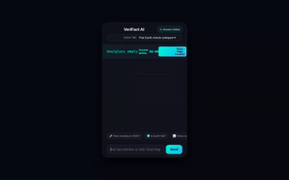

# 🛡️ VeriFact AI · AI Fact-Checker & Hallucination Detector

> A premium, conversational AI assistant designed to verify claims, evaluate source credibility, and calculate hallucination likelihoods using Google Cloud's most advanced reasoning engines.

<div align="center">
  
  <p><i>VeriFact AI running inside a high-fidelity Chrome Extension Popup simulator, with ticking permission timers, active tab scanning, and dynamic Firestore catalog retrieval.</i></p>
</div>

---

## 📖 Project Overview

**VeriFact AI** helps users debunk claims, analyze browser tab content, and calculate precise **Hallucination Likelihood Percentages** on demand. Grounded on verified documents and empowered by statistical weights processed in a secure sandbox, it translates complex web findings into clean visual diagnostics and automatically indexes results in a global truth catalog.

---

## 🌟 Key Features

* **Real-time Active Tab Scanning**: Read page context dynamically from mock tabs (Wikipedia, Scientific American, etc.) under an interactive, ticking countdown permission window.
* **Algorithmic Hallucination Scoring**: Safely runs advanced heuristic scoring scripts in a secure Python sandbox to weigh source conflicts and compute factual likelihoods.
* **Community Fact Pool & Firestore History**: Commits verified claims, verdicts, and cited URLs to a global Firestore database, allowing users to query history instantly.
* **Google Omni Video Explanations**: Generates cinematic, educational visual summaries debunking or explaining fact-checks using Google's `gemini-omni-flash-preview` model.
* **Branded Dialogue Chat Interface**: Glassmorphic neon-mint UI with dedicated secure shield avatar rows and custom text response containers.
* **Interactive Prompt Quick-Starts**: One-click pills directly above the input box (Mars 2024 landing, Flat Earth catalog, Firestore list retrieval) for immediate testing.

---

## 🧠 Google Cloud Architecture & Tools

Every capability in **VeriFact AI** is backed by an enterprise Google Cloud service:

| Google Cloud Component | Role in VeriFact AI | Powered By |
|---|---|---|
| 🤖 **Reasoning Core** | Conversational reasoning & card schema output | **Gemini 2.5 Flash** |
| 🎬 **Omni Media Gen** | Direct, serverless video explanation generation | **gemini-omni-flash-preview** (Global) |
| 🗄️ **Structured Data** | Persisting and listing the global truth catalog | **Cloud Firestore** |
| 🖼️ **Media Registry** | Hosting generated video bytes under public HTTPS endpoints | **Cloud Storage (GCS)** |
| 📖 **Grounded RAG** | Indexing guidelines and verified truth documents | **Vertex AI RAG Engine** |
| 🧪 **Secure Sandbox** | Safely compiling source credibility heuristic calculations | **Agent Engine Code Executor** |
| 🧠 **Persistent Context** | Retaining active scenarios and preferences across sessions | **Vertex AI Memory Bank** |
| 🪟 **Agent-First UI** | Rendering structured interactive detail cards | **A2UI Schema Manager (v0.8)** |
| 🌐 **A2A Proxy Gateway** | Orchestrating browser client-to-agent reasoning passes | **FastAPI + Cloud Run** |

---

## 📁 Repository Directory Structure

```text
ai-fact-checker/
├── app/                      # Main Agent Package
│   ├── agent.py              # Main Agent logic, Prompt & Tool registry
│   ├── a2ui_utils.py         # A2UI card renderer after_model_callback
│   ├── app_utils/            # Modular Helper Tools
│   │   ├── firestore_db.py   # Firestore read/write collection services
│   │   ├── rag_tool.py       # Vertex AI RAG Engine Retrieval
│   │   ├── global_memory.py  # Active session Memory Bank callback filters
│   │   └── video_generator.py# Google Omni Video Generator & GCS Uploader
├── frontend/                 # Chat Frontend & A2A Proxy
│   ├── main.py               # FastAPI A2A client proxy
│   └── static/               # Rebranded Neon Glassmorphic UI 
│       └── index.html        # High-fidelity Chrome Extension Popup
├── tests/                    # Unit & Integration Tests suite
├── pyproject.toml            # Astral uv package config
└── demo.gif                  # Snappy looping demo video
```

---

## 🚀 Getting Started Locally

### 1. Install Dependencies
Ensure you have Astral [uv](https://docs.astral.sh/uv/) and the `google-agents-cli` installed. Then run:
```bash
agents-cli install
```

### 2. Set Up Environment Variables
Create a `.env` in the root (matching `.env.example`) or run:
```bash
export AGENT_ENGINE_RESOURCE_NAME="projects/419816504777/locations/us-east1/reasoningEngines/6326484353106837504"
export AGENT_DIRECTORY="app"
```

### 3. Run the FastAPI Local Server
Start your proxy and WebUI on port `8080`:
```bash
cd frontend
uv run python main.py
```
Open **`http://localhost:8080/`** in your browser to experience **VeriFact AI**!

### 4. Run Automated Quality Checks
Confirm full compilation stability by running unit and integration tests:
```bash
uv run pytest
```
